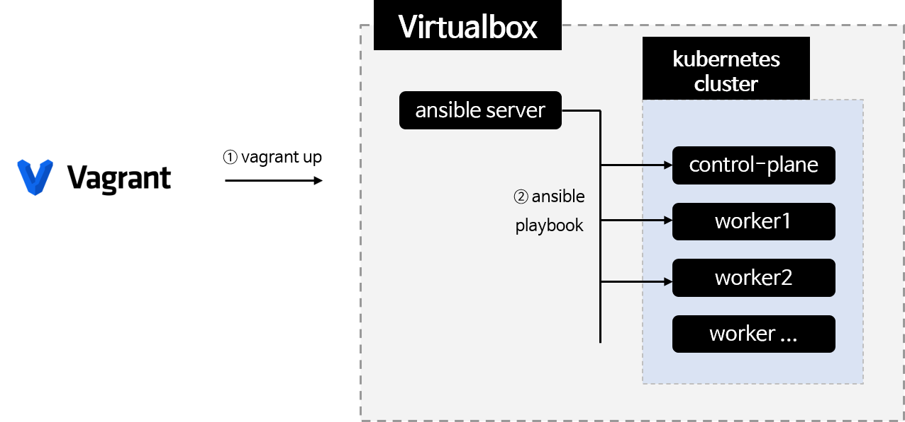
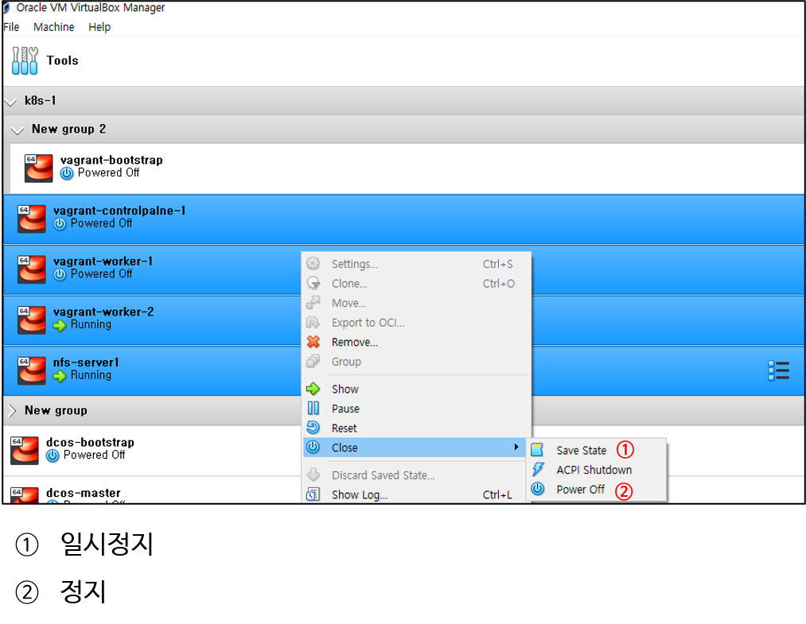
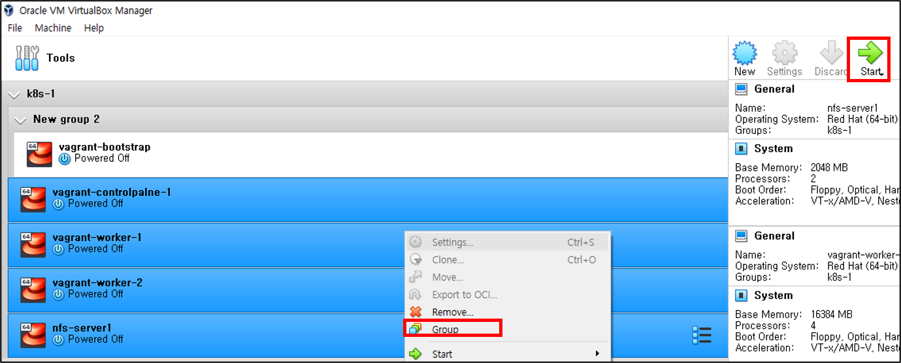

- [1. 개요](#1-개요)
- [2. 준비](#2-준비)
- [3. 설정파일 준비](#3-설정파일-준비)
- [4. 쿠버네티스 설치](#4-쿠버네티스-설치)
  - [설치](#설치)
  - [설치 확인](#설치-확인)
- [5. 일시정지와 실행](#5-일시정지와-실행)
  - [일시정지 또는 정지](#일시정지-또는-정지)
  - [시작](#시작)
- [6. 삭제](#6-삭제)
- [7. 참고자료](#7-참고자료)

# 1. 개요
* vagrant와 ansible을 이용하여 쿠버네티스 자동 설치



<br>

# 2. 준비
* vagrant, virtualbox 설치
* python3.6 이상 설치
* 외부통신이 되는 환경
* 충분한 CPU와 메모리
  * 권장 메모리: 32GB이상
  * 권장 CPU: 4core 이상

<br>

# 3. 설정파일 준비
* 설정파일 생성 스크립트 실행
[설정파일 메뉴얼 이동](./config/Readme.md)

<br>

# 4. 쿠버네티스 설치
## 설치
```sh
# vagrant up
```
## 설치 확인
```sh
# ssh vagrant@[control-plane IP]
# sudo su
# kubectl get no ; 모든 노드 Ready 확인
# kubectl get po -A ; 모든 pod running상태 확인
# helm ; helm 설치 확인
```

# 5. 일시정지와 실행
> 이 메뉴얼은 vagrant로 production환경을 사용할 경우 부적절합니다.
## 일시정지 또는 정지


## 시작



# 6. 삭제
> virtualbox를 수동으로 제어한 경우 삭제 명령어 제대로 동작하지 않습니다. 수동으로 제어한 경우 destroy 명령어 실행 후 virtualbox폴더(C:\Users\VirtualBox VMs)에 가서 삭제하고자 하는 vm폴더를 수동삭제해야 합니다.
```sh
vagrant destroy --force
```

<br>

# 7. 참고자료
* [1] dashboard 설치 영상: https://youtu.be/6MnsSvChl1E
* [2] install k8s playbooks role: https://github.com/geerlingguy/ansible-role-kubernetes/blob/master/tasks/main.yml
* [3] dashboard 공식문서: https://kubernetes.io/ko/docs/tasks/access-application-cluster/web-ui-dashboard/
* [4] dashboard 공식git: https://github.com/kubernetes/dashboard